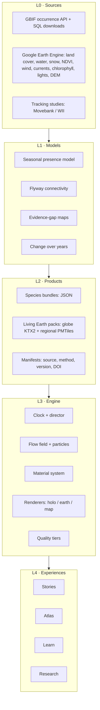

# Architecture

Wildlife Atlas is built in five layers. Each layer reads the layer below it only through a versioned, described contract, so any layer can be rebuilt or replaced without touching the others.

## Contracts

| Boundary | Contract | Where |
|---|---|---|
| L0 → L1 | Raw responses cached as JSON, one file per request, safe to resume | `data/raw/gbif/` (`data` branch holds `raw.tar.gz`) |
| L1 → L2 | Python dataclasses: `CellSummary`, `GlobalRange`, presence labels | `pipeline/atlas_pipeline/` |
| L2 → L3 | Static files with `meta.json`: source, years, measure, coverage, demo flag | `web/public/data/` |
| L3 → L4 | `SceneView` interface (setSpecies, update, flyTo, camera, onPick) and the shared `Clock` | `web/src/scene/view.ts`, `clock.ts` |

A new product (for example the Living Earth packs) must ship its own manifest, and the engine must refuse to load a product without one.

## Runtime topology
- **Build time:** GitHub Actions runs the L0 fetches off the corporate network and publishes to the `data` branch. Earth Engine exports feed the Living Earth packs.
- **Serve time:** everything is static. Species bundles ship with the web build. Large tile packs go to Cloudflare R2 behind a CDN and load through HTTP range requests.
- **No backend** until a feature needs one: accounts, native observations or a query API.

## Engine principles
- One clock (`createClock`) drives every view. Stories, scrubbing and playback all move the same `t` (months, mid-month anchored).
- Renderers are swappable behind `SceneView`. The hologram (three.js) is the default, Earth (Cesium) handles realistic moments, and MapLibre handles street-level detail.
- Quality is chosen from measured frame time, never from device names (decision 0006).

## Quality gates
- Pipeline: pytest with coverage. Web: vitest, type check and build.
- The board (`features/` + CI test results) is the record of what works. A feature is only **working** when the tests it lists pass on `main`.
